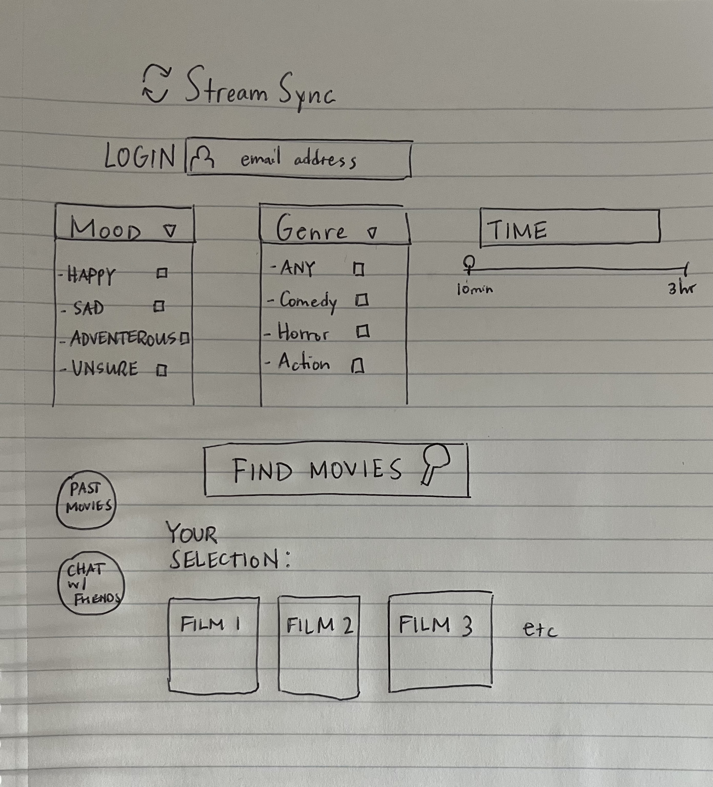

# StreamSync
Imagine planning a movie night with your friends or partner, but instead of burning 30 minutes scrolling through endless streaming libraries searching for the right pick, you can instantly get the perfect movie recommendation tailored to everyone's mood, genre preferences, and available streaming services in an instant. *StreamSync* is your personalized movie recommendation web app that uses your mood, time availability, and trending events to deliver the best suggestions in seconds, making sure your movie nights are always a hit!

# Design 
Here's a simple, rough draft design of the application
 

## User Flow
1. User inputs their mood, time availability, and genre and clicks the "Find Movies" button 
2. Client Application sends the request to the Server 
3. Server processes the request and calls the public API to get relevant movie data 
4. The API returns a list of movies to the Server 
5. Server responds to the Client Application with the movie list 
6. User views the movie list 
7. (Potentially) The User chats with friends about movie choices via WebSockets

## Technologies 
#### HTML
Structuring the web pages with proper HTML elements. The main page will allow users to select mood, genre, and time availability, while the result page will display movie suggestions. Another page will allow users to log in and manage profiles
#### CSS
Styling will ensure a responsive and user-friendly interface. CSS animations will enhance the user experience, especially for interactions like selecting moods and genres
#### React
Components will handle mood selection, API calls, and rendering movie results. React Router will be used for navigation between different pages, such as the login and recommendation page
#### Service
The backend will use `Node.js/Express` and make API calls to the API for fetching movie recommendations based on the user’s mood, genre, and time availability.
#### API Endpoints
- Retrieve movie genres
- Get trending movies
- Discover movies based on user input
#### DB/Login
A database will store user data, including preferences, watch history, and login credentials
#### WebSocket
WebSockets can be implemented for real-time chat between users

[View Notes](notes.md)
